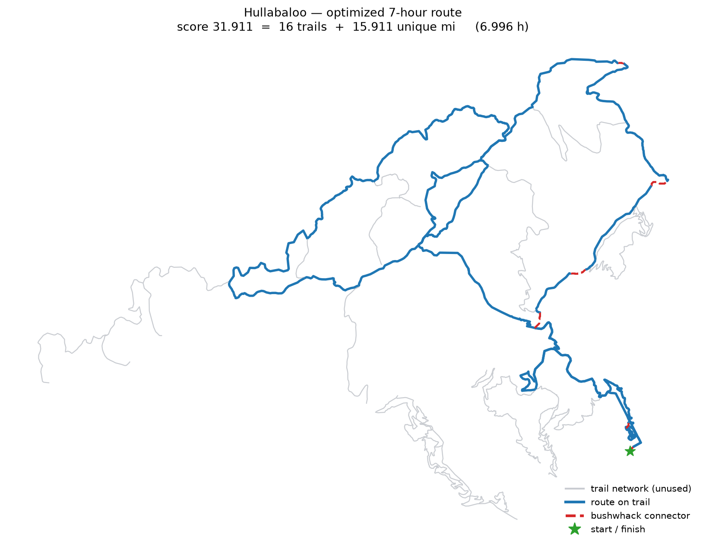

# Hullabaloo — optimizing a 7-hour trail rogaine

Route optimization for the **Blacksburg Adventure Skills Hullabaloo**, a timed rogaine on
the Pandapas Pond / Poverty Creek trail network near Blacksburg, Virginia.

You get 7 hours. You score two ways, each capped at 40 points:

- **1 point per trail** completed end to end — there are 40 trails
- **1 point per unique mile** of trail covered — there are 39.7 miles

Covering the entire network would score a perfect 80. It would also take **14.3 hours**.
With 7, only about 45% of the network is reachable, so the whole game is deciding *which*
45%. That makes this a **prize-collecting arc routing problem**: points sit on edges rather
than nodes, re-walking an edge earns nothing the second time, and the tour must start and
finish at the trailhead.



## Result

| | score | trails | unique miles | time |
|---|---|---|---|---|
| greedy nearest-trail baseline | 26.4 | 16 | 10.4 | 6.36 h |
| greedy best-ratio baseline | 24.1 | 13 | 11.1 | 6.10 h |
| **ALNS** | **35.2** | **19** | **16.2** | **6.99 h** |

The optimizer finds a **33% improvement** over a sensible greedy baseline. Because a
heuristic cannot certify its own quality, the same problem is also written as a MILP and
handed to HiGHS purely to produce an upper bound — so the result can be stated as a
distance from proven optimal rather than an unqualified number. See
[`outputs/run_report.json`](outputs/run_report.json) for the exact figures from the last run.

Deliverables land in `outputs/`:

- `hullabaloo.gpkg` — one multi-layer GeoPackage: `edges`, `nodes`, `trails`,
  `connectors`, `route`, `depot`
- `route.gpx` — the tour as a GPX track with a predicted schedule, loadable onto a watch
- `route_cues.csv` — turn-by-turn cue sheet with running time and running score
- `route_map.png`, `run_report.json`

## Running it

```bash
pixi install
cp .env.example .env          # then set TNT_USER / TNT_PASS

pixi run pipeline             # end to end; skips stages whose output exists
pixi run pipeline-bounded     # also spends 10 min proving an optimality bound
pixi run test                 # 21 tests
pixi run app                  # interactive marimo app
```

The first run downloads a 206 MB lidar tile and caches it.

## The three problems worth talking about

### 1. The input is not a network

The site publishes one GPX per trail. Downloading all 40 gives 40.14 miles of geometry and
**no topology at all** — 40 independent `LineString`s that merely overlap on a map.

The instinct is to snap coincident endpoints together. On this data that fails badly:

| contact type | count (within 10 m) |
|---|---|
| endpoint meets another **endpoint** | 20 / 80 |
| endpoint meets another trail's **geometry** | 55 / 80 |

The network is dominated by **T-junctions** — a trail ending partway along another — plus
10 genuine interior X-crossings. Endpoint-only snapping leaves most junctions unconnected
and routes nothing. So each trail is cut at split positions gathered from three sources
(true intersections, foreign-endpoint projections, own endpoints), and the resulting
endpoints are clustered into shared nodes. Every edge keeps its parent `trail_id`, because
"trail completed" is defined over a trail's complete edge set.

The snap tolerance is a real judgement call, so it is picked from a sweep rather than
asserted. Component count falls 14 → 6 → 4 → **3** and then flatlines at 3 all the way out
to 50 m. That plateau is the structural floor; 18 m is the smallest tolerance that reaches
it. Every junction that exists only above 10 m was then reviewed individually against
imagery (`topology.junctions_in_band`) — each is a real intersection where two
independently recorded tracks disagree by plausible under-canopy GPS error.

### 2. The network is in three pieces

After noding, the 40 trails form **three components** separated by genuine 285–700 m gaps
that no snapping will ever close:

| component | trails | miles |
|---|---|---|
| main | 28 | 30.8 |
| north | 7 | 5.8 |
| west | 5 | 3.5 |

So off-trail travel is not a refinement — without it, no route can score above the main
component's ceiling. Connectors are least-cost paths over a Tobler-derived cost surface run
at 60% speed, which brings the network to a single component.

Two things this phase needs to get right:

- **Water must be masked.** Pandapas Pond sits in the middle of the study area, and a cost
  surface that ignores it routes straight across open water. NHD hydrography contributes
  4.7 ha of impassable cells. An earlier flatness-based fallback heuristic flagged **20% of
  the map** as water; the code now rejects any fallback mask claiming more than 2% of the
  area rather than silently warping every connector.
- **`MCP_Geometric` is isotropic.** It prices cells by slope *magnitude*, so path selection
  treats up and down alike. True directional Tobler time is re-integrated along the returned
  polyline, restoring asymmetry in the routing graph. `MCP_Flexible` is the fully
  anisotropic upgrade if that ever matters.

The realised off-trail speed comes out at 0.56× on-trail rather than the nominal 0.60×,
because connectors cut across slopes that graded trail contours around.

### 3. Scoring on arcs breaks the usual machinery

Points sit on edges, each edge pays only once however often it is walked, and completing a
trail requires *all* of its edges. Standard TSP/VRP formulations do not apply.

**Encoding.** A solution is an ordered list of target trails. A deterministic decoder turns
it into a real walk: from the current position, take the shortest path to whichever end of
the next trail is cheaper, walk it end to end, repeat, return to the depot. Every solution
is connected and depot-anchored *by construction*, so the ALNS operators only reason about
which trails and in what order — never about graph connectivity. Deadhead legs often cross
trail not yet walked, and those miles score, so the evaluator credits every edge the walk
actually touches.

**The bound.** The MILP exists to say what the heuristic cannot: how far from optimal the
answer is. Its one easy-to-forget constraint is **connectivity** — flow conservation alone
is satisfied by any set of disjoint circuits, so without a single-commodity-flow constraint
tying the traversed subgraph to the depot, the solver returns a lovely high-scoring loop on
the far side of the property that never touches the start line.

## Elevation

USGS 3DEP **1 m lidar** (`VA_FEMA-NRCS_SouthCentral_2017`, tile `x54y413`), driving a
parameterized Tobler hiking function:

```
W(S) = base * exp(-k * |S + s0|)     km/h,  S = rise/run
defaults: base 6.0, k 3.5, s0 0.05;  off-trail x0.60
```

The `s0` offset puts peak speed on a gentle *downhill*, which is exactly why the routing
graph must be directed — the optimizer can and does exploit which way round to run a loop.
Time is integrated segment by segment along each profile, since Tobler is convex in |slope|
and averaging grade over a whole trail badly underestimates rolling terrain.

Defaults imply **3.13 mph on the flat** (19.2 min/mile). These are literature constants,
**not** calibrated to a specific person carrying a pack for seven hours — `pace_factor`
exists for that.

### Validating against published gains

The site publishes forward *and* reverse elevation gain for all 40 trails: 80 free
ground-truth values. Lidar-derived gain regresses at **R² ≈ 0.85** with near-zero bias.

The residuals are interesting rather than alarming:

- **Crosscut** is published at **1 ft** of gain over 990 m of singletrack, and its GPX
  elevation profile is *exactly monotone* — physically implausible on real trail. The
  published figures are computed from GPX elevations and inherit whatever the recording
  device did.
- **Upper Chimney**, a sustained 1,100 ft climb, agrees closely across GPX, published, and
  lidar — noise barely matters when the signal is that large.
- **Prickly Pear** is the biggest disagreement (published 688 ft, lidar 185 ft). Lidar and
  GPX agree *exactly* at the low end (696 m) and diverge only near the top, which points to
  GPS elevation drift rather than misplaced geometry.

Bare-earth lidar is the more trustworthy source, and it is what the model uses.

Smoothing is specified in **metres, not pixels** — a `sigma=3` read as pixels means 3 m on
the lidar but 30 m on the 10 m fallback, which flattens genuinely steep trails. Total
network traversal time moves only **3.4%** across sigma 0–12 m, so the model is not hostage
to the choice; 5 m drives the bias against published gains to roughly zero.

## Layout

```
src/hullabaloo/
  config.py        every tunable, in one place
  ingest.py        login, scrape trail table, download GPX
  topology.py      planarize -> noded, validated network
  elevation.py     3DEP fetch, smooth, sample profiles
  tobler.py        parameterized speed model
  bushwhack.py     cost surface + least-cost connectors
  graph.py         directed time-weighted graph, and the single score() definition
  optimize_alns.py destroy/repair search with SA acceptance
  optimize_milp.py exact formulation, for the bound
  export.py        GeoPackage / GPX / cue sheet / map
  pipeline.py      end-to-end runner
notebooks/         marimo (.py, git-diffable)
tests/             21 tests
```

Logic lives in `src/`, notebooks import it. Notebooks stay readable, functions stay
testable.

## Stack

`geopandas` · `shapely 2` · `pyogrio` · `pyproj` · `rasterio` · `rioxarray` ·
`scikit-image` · `scipy` · `networkx` · `PuLP` + `HiGHS` · `marimo` · `pixi`

Working CRS is **EPSG:6346** (NAD83(2011) / UTM 17N, metres), matching the lidar tiling.

## Honest limitations

- **Tobler is uncalibrated.** The constants are from the literature, not from anyone's
  actual pace over seven hours with a pack. Fitting `base`/`k` to real Strava times on
  these trails would be the single highest-value improvement.
- **Bushwhack legality is assumed.** Confirm off-trail travel is permitted; setting
  `off_trail_factor` very low approximates a trail-only scenario.
- **The lidar is 2016/17 vintage** and predates any recent trail work.
- **The three components may be joined by forest roads absent from the dataset.** Worth
  checking the gaps against imagery; a real road should be added as a full-speed connector
  rather than a 60% bushwhack.
- **Scoring is interpreted** as fractional miles plus whole trails. It is isolated in one
  `score_edges` function, so an alternate reading is a one-line change.

## Data

Trail data © The Trail Not Taken / tanZ Navigation LLC, accessed with a guest account.
Elevation from the USGS 3D Elevation Program (public domain). Hydrography from USGS NHD.
